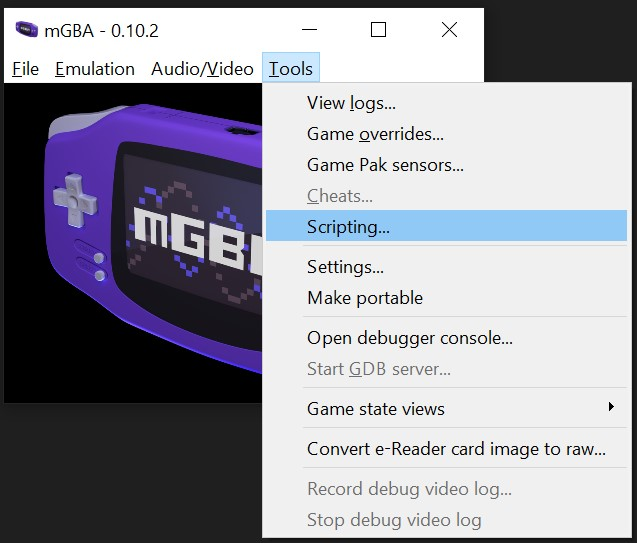
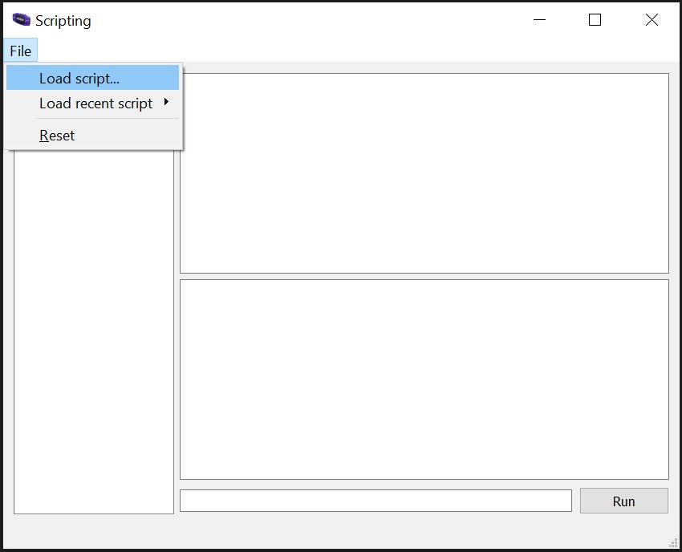
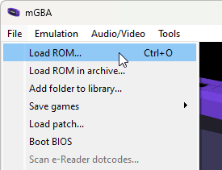
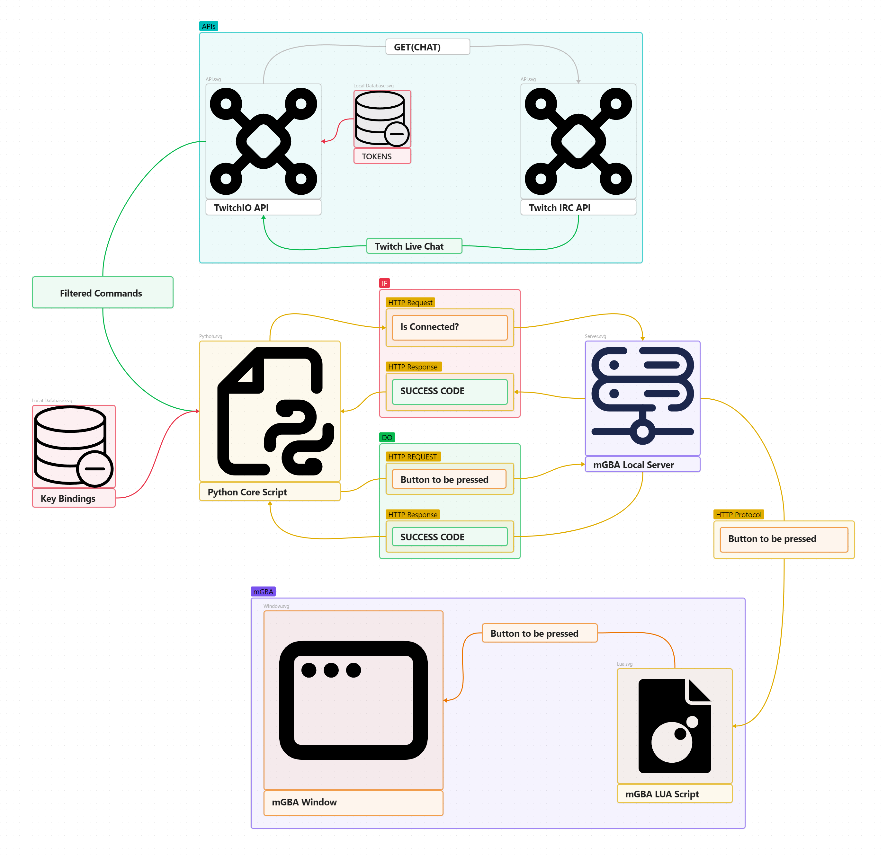

# Twitch Plays Pokemon

## PREREQUISITES
- This uses Python 3.7+. You can download the latest version of Python [here](https://www.python.org/downloads/).
- Some Python Modules [These are going to be installed in [INSTALLATION](#installation)]
  - TwitchIO
  - DotEnv
  - Requests
- mGBA Emulator. You can download the lastest version of mGBA [here](https://mgba.io/downloads.html)
- A Game Rom Playable in GBA.
- A Twitch Channel.
- A Twitch Developer Account. [If You don't have this, Foloow [these steps](#how-to-register-an-app-in-twitch)]
- That Channel's Access_Token. You can generate one [here](https://twitchtokengenerator.com/)
  
## INSTALLATION 
</br>
🚨🚨 [ALL OF THESE ARE ONLY FOR THE FIRST TIME RUNNING. IF YOU HAVE COMPLETED THIS BEFORE READ THE USAGE SECTION] 🚨🚨
</br>

- Download this Repository in your local machine.

- Open this Folder

- Make a file named ```.env``` and open it in your preffered text editor.

- Paste this in there
  ```
  ACCESS_TOKEN=<YOUR ACCESS_TOKEN>
  INITIAL_CHANNEL=<YOUR CHANNEL NAME>
  USERNAME=<YOUR CHANNEL NAME IN NO CAPS>
  ```

- You now need to Download the modules mentioned before.
  - ### For Windows
    - Open CMD in the current folder
    - Paste this ```pip install -r requirements.txt && python install.py``` and press Enter.
    - Wait for it to download the requirements and files.
    - After it finishes the download, close the CMD Window.
  - ### For Linux
    - Open Terminal in the current folder
    - Paste this ```pip install -r requirements.txt && python install.py``` and press Enter.
    - Wait for it to download the requirements and files.
    - After it finishes the download, close the Terminal Window.

- Now open the ```mGBA_Controller_Essentials``` folder. There you'll see 3 things
  - ```mGBA-http-0.2.0-linux-x64-self-contained``` <-- [ For Handling the HTTP Server in Linux ]
  - ```mGBA-http-0.2.0-win-x64-self-contained.exe``` <-- [ For Handling the HTTP Server in Windows ]
  - ```mGBASocketServer.lua``` <-- [The Client Script]

- Open mGBA and click Tools -> Scripting to open the scripting window
  

- In the scripting window click File -> Load script to bring up the file picker dialog.
  

- Pick the ```mGBASocketServer.lua``` client script and press Run.

- Then close that window.

## USAGE
</br>
🚨🚨 [ONLY WORKS AFTER INSTALLATION PART IS DONE] 🚨🚨
</br>

- Run the HTTP Server tool
  - ### For Windows
    - Just Run ```mGBA-http-0.2.0-win-x64-self-contained.exe``` like any other programs.
  - ### For Linux
    - Open Terminal in ```mGBA_Controller_Essentials``` folder and paste this command ```chmod +x mGBA-http-0.2.0-linux-x64-self-contained``` and press Enter.
    - For running the server paste this ```./mGBA-http-0.2.0-linux-x64-self-contained``` and press Enter.

- After this in mGBA click on File -> Load ROM
  </br>
  

- Load the game ROM.

- Then run the ```main.py``` file using this command ```python main.py```
  - ### For Windows
    - Use CMD to run the command.
  - ### For Linux
    - Use Terminal to run the command.
- If something shows up in this format
  ```
  Logged in as | <YOUR USERNAME>
  User id is | <YOUR USER_ID>
  ```
  - Capture the window of the mGBA in your stream setup and start streaming!

## COMMANDS TO INTERACT WITH THE GAME

| Commands              | Usage |
| :----------------: | :------: |
| !START_THE_GAME        |   Starts the game [Can Only be Used by Channel Owner]   |
| !STOP_THE_GAME           |   Stops the game [Can Only be Used by Channel Owner]  |
| !START    |  For Pressing 'Start'   |
| !SELECT    |  For Pressing 'Select'   |
| !A    |  For Pressing 'A'   |
| !B    |  For Pressing 'B'   |
| !L   |  For Pressing 'L Trigger'   |
| !R    |  For Pressing 'R Trigger'   |
| !UP    |  For Pressing 'Up'   |
| !DOWN    |  For Pressing 'Down'   |
| !LEFT    |  For Pressing 'Left'   |
| !RIGHT    |  For Pressing 'Right'   |
  
## TROUBLESHOOTING

- ### Module Error

  - #### TwitchIO Module

    - ##### For Windows

      - Run these commands

        - ```pip install -U twitchio```

        - ```pip install -U twitchio[speed] --extra-index-url https://pip.twitchio.dev/```

        - ```pip install -U twitchio[sounds] --extra-index-url https://pip.twitchio.dev/``` [If you get an error in this command you can skip this one]

        - ```pip install -U twitchio[your-extra] --extra-index-url https://pip.twitchio.dev/```

    - ##### For Linux

      - Run these commands 

        - ```python3 -m pip install -U twitchio```

        - ```python3 -m pip install -U twitchio[speed] --extra-index-url https://pip.twitchio.dev/```

        - ```python3 -m pip install -U twitchio[sounds] --extra-index-url https://pip.twitchio.dev/``` [If you get an error in this command you can skip this one]

        - ```python3 -m pip install -U twitchio[your-extra] --extra-index-url https://pip.twitchio.dev/```

  - #### DotEnv Module
     
     - Run this command
       ```pip install python-dotenv```

  - #### Requests Module

    - Run this command
      ```pip install requests```

- ### ACCESS_TOKEN Error
  
  - You can try using other ACCESS_TOKEN generators online, or generate a new one using the previous 

- ### To Avoid Other Mistakes

  -  Make sure you put the right name for your channel.

  -  [New errors and, the guide to avoid them will be added in future.]

# How to Register an App in Twitch [Same as the [Offcial Twitch Instructions](https://dev.twitch.tv/docs/authentication/register-app/) but optimised for this bot]
- The first step to getting an access token is to register your application (this includes any kind of Twitch bots). To register an application:
  - Log in to the [developer console](https://dev.twitch.tv/console) using your Twitch account. If you don’t have an account, select the Sign Up tab to create one.
    - When you sign up for an account, Twitch sends you an email to verify your account. Be sure to open the email and verify your account before proceeding.
    - You must also enable two-factor authentication (2FA) for your account. To enable 2FA, navigate to Security and Privacy, and follow the steps for enabling 2FA under the Security section.
    - You’ll need to refresh your console for these changes to take effect.
  - Select the Applications tab on the developer console and then click Register Your Application.
  - Set Name to your application’s name. [The name must be unique among all Twitch applications, if uou make one yourself] Your app’s name is listed on the [Connections](https://www.twitch.tv/settings/security) page under Other Connections if your app requires user consent to access or modify the user’s resources.
  - Set OAuth Redirect URLs to the callback URL that your app uses for authorizations. [Use this URL: ```http://localhost:17563```]
  - After adding your redirect URL, click Add
  - Select a Category (type of application) that your app belongs to.
  - Click the I’m not a robot checkbox.
  - Back in the Applications tab, and if eneything went right you should be able to locate your app under Developer Applications.

# IMPORTANT NOTE
***Treat client secrets and any kind of Tokens as you would your password. You must keep it confidential and never expose it to anyone, even in an obscured form.***

***I DO NOT own any of the rom files provided in the repository. They all are made by Nintendo. (Please don't sue me Nintendo ಥ⁠‿⁠ಥ )***

# Design Document [To get a generic idea on what's going on in this project]


# UPDATE NOTES

- 12th April 2024:
	- Added a Design Document for this project.
	- Updated ```README.md```

- 11th April 2024:
	- Added ```main.py```
	- Added two game roms
	- Added ```install.py```
	- Added ```requirements.txt```
	- Added ```COMMANDS.txt```
	- Updated ```README.md```
